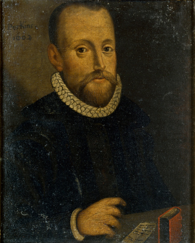

# The Works of William Perkins

[Published site](https://shepherds-scribes.github.io/william-perkins/)

William Perkins (1558-1602) was one of the leaders of Elizabethan Puritanism. His writings and personal influence impacted a whole generation of Puritan ministers and theologians, including William Ames, Thomas Goodwin, James Ussher, Richard Sibbes, and countless more.

Our goal is to make his public-domain works freely and easily accessible for the Church of today. The original scanned work will be transcribed to Markdown, and this will be used to generate copies in HTML, PDF, and perhaps other formats.

## Note

This repo includes rasterized PDFs of the original work's pages under `sources`, and so clocks in at close to 1GB (counting the .git folder). Cloning may take some time!