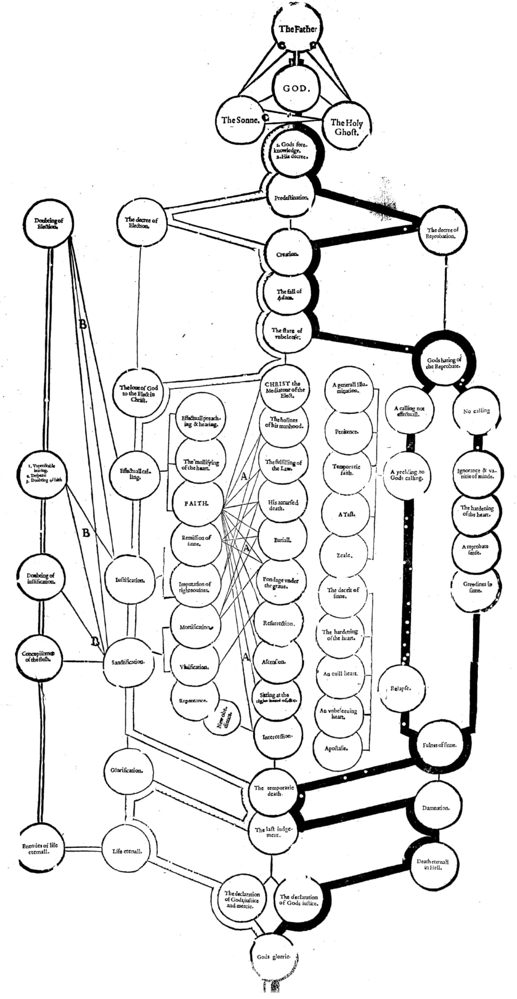

# A ſuruey, or Table declaring the order

of the cauſes of Saluation and Damnation, according to Gods word. It may be in ſtead of an *ocular Catechiſme* to them which cannot read: for by the pointing of the finger they may ſenſibly perceiue the chiefe points of religion, and the order of them.

> God created all things for himſelfe, and the wicked man for the euill day. Prov. 16. 4.  
> Hath not the potter power ouer the clay, to make of the ſame lumpe one veſſell to honour, and another to diſhonour? Rom. 9. 21.  
> If any be in Chriſt, let him be a new creature. 2. Cor. 5. 17.  

> To the Reader.
> The white line ſheweth the order of the cauſes of ſaluation from the firſt to the laſt. [^1]  
> The blacke line ſheweth the order of the cauſes of damnation. [^1]  
> Lines. A. A. A. ſhew, how faith doth apprehend Chriſt and all his benefits, and applieth them to the perſon of euery beleeuer for his iuſtification and ſanctification. [^1]  
> Lines B. B. B. deſcending, likewiſe ſhew the tentation of the godly, and their remedies. [^1]  
> Inside ſpaces C. C. C. ſhew the communication of the Godhead from the Father to the Sonne, and from them both to the holy Ghoſt. [^1]

> O the altitude of the riches, both of the wiſedome and knowledge of God! How vnſearchable are his iudgements, and his waies paſt finding out? Rom. 11.33.  
> I count all things but dung, that I may winne Chriſt. Philip 3. 8.  
> Ignatius ſaying, *My loue is crucified*

[^1]: Transcriber's note: The scan here is incomplete, so the first word of the line is an approximate reconstruction.