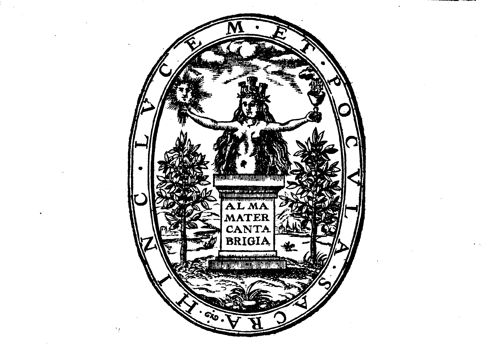

# THE WORKES OF THAT FAMOVS AND WORTHY MINISTER OF CHRIST in the Vniuerſitie of CAMBRIDGE, MR. WILLIAM PERKINS.

## THE FIRST VOLVME: NEWLY CORRECTED ACCORDING TO HIS OWNE COPIES.

WITH DISTINCT CHAPTERS, AND CONTENTS of euery Booke, and two Tables of the whole: one, of the matter and queſtions, the other of choice places of Scripture.

> ISA. 57. verse 1.  
> The righteous periſheth, and no man conſidereth it in heart: mercifull men are taken away, and no man underſtandeth that the righteous is taken away from the euill to come.

> 2\. PET. 1. verse 15.  
> Neuertheleſſe, I will endeauour alwaies, that ye alſo may bee able to haue remembrance of theſe things after my departing.

London,  
Printed by **Iohn Legatt.**  
1626.  
